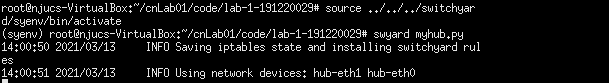

# <center>南京大学本科生实验报告</center>

课程名称： **计算机网络**						任课教师：李文中				助教：

|   学院    | 计算机科学与技术  |   专业（方向）    |   计算机科学与技术    |
| :-------: | :---------------: | :---------------: | :-------------------: |
| **学号**  |     191220029     |     **姓名**      |        傅小龙         |
| **Email** | 1830970417@qq.com | **开始/完成日期** | 2021/3/10 - 2021/3/13 |


## 1.实验名称

Lab1: Switchyard & Mininet


## 2.实验目的

熟悉实验流程、环境。


## 3.实验内容

### 3.1Modify the Mininet topology

本报告中选取删除拓扑中的2号服务器(`server2`)

`start_mininet.py`文件中的`nodes`变量中包含了`Mininet`网络拓扑中结点相关信息。将其中`server2`结点相关的设置注释掉。如下所示：

```python
nodes = {
    "server1": {
        "mac": "10:00:00:00:00:{:02x}",
        "ip": "192.168.100.1/24"
    },

    #"server2": {
    #    "mac": "20:00:00:00:00:{:02x}",
    #    "ip": "192.168.100.2/24"
    #},

    "client": {
        "mac": "30:00:00:00:00:{:02x}",
        "ip": "192.168.100.3/24"
    },
    "hub": {
        "mac": "40:00:00:00:00:{:02x}",
    }
}
```

保存相关修改后启动`Mininet`，使用`nodes`指令查看网络拓扑中所有节点：

```
mininet> nodes
available nodes are: 
client hub server1
```

发现server2不在其中，说明server2节点已经被删除.

### 3.2Modify the logic of a device

修改`myhub.py`以统计虚拟网络中设备收到和发出的数据包的数量。

在函数`main`下定义局部变量`cnt_in`和`cnt_out`分别统计当前设备收到和发出的数据包数量：

```python
cnt_in = 0
cnt_out = 0
```

在`while`循环体内完成异常处理(对应`try`语句块)后即确认收到数据包，在`log_debug`之后将`cnt_in`计数增加1：

```python
cnt_in = cnt_in + 1
```

之后的`if`语句块对收到包的包头进行分析。最内层的`if`语句块为确认该包将发送给其他节点，故在该语句块最后将`cnt_out`计数增加1：

```python
cnt_out += 1
```

在每个条件分支的最后添加数据包数量的输出：

```python
print("in:" + str(cnt_in) + "\tout:" + str(cnt_out))
```

在`switchyard`中运行3.1节中修改后的`mininet`网络拓扑，使用`pingall`指令得到如下实验结果：

```
mininet> pingall
*** Ping: testing ping reachability
client -> X server1 
hub -> X X 
server1 -> client X 
*** Results: 66% dropped (2/6 received)
```


### 3.3Modify the test scenario of a device

本报告中选择使用给出的函数`new_packet`来创造一个测试样例。

将原样例注释。这里设计了一个由`10:00:00:00:00:02`接口发给自己的数据包：

```python
mypkt = new_packet(
        "30:00:00:00:00:01",
        "10:00:00:00:00:02",
        "192.168.100.1",
        "192.168.100.3"
    )
```

因而应有：hub检测到有收到数据包，目标收`eth2`到包后应无响应。故：

```python
s.expect(
    PacketInputEvent("eth1", mypkt, display=Ethernet),
    ("MYCASE: An Ethernet frame from 30:00:00:00:00:01 to 10:00:00:00:00:02")
)
s.expect(
    PacketInputTimeoutEvent(1.0),
        ("MYCASE: one pack for eth2 itself")
    )
```

### 3.4Run your device in Mininet

参照 实验手册Lab1-Task2-Swichyard 一节中的介绍，在`Mininet`上运行修改后的`Switchyard`项目的步骤及结果如下：

①在终端中启动`Mininet`：

```
~.../lab-1-191220029$ sudo python start_mininet.py
mininet> xterm hub
```

②在xterm窗口中进入虚拟环境并启动网络拓扑



③在终端输入`pingall`指令

```
mininet> pingall
*** Ping: testing ping reachability
client -> X server1 
hub -> X X 
server1 -> client X 
*** Results: 66% dropped (2/6 received)
```

同时xterm窗口显示了对数据包收发的统计：


注意到`myhub.py`成功统计到了6个因`pingall`命令而产生到的包。

### 3.5Capture using Wireshark

参照 实验手册Lab1-Task2-Swichyard 一节中的介绍, 重启`xterm`窗口的`myhub.py`程序，并启动`wireshark`程序监听`client-eth0`端口，并输入如下`ping`指令：

```
mininet> client ping -c1 server1
```

终端上得到如下结果：

```
PING 192.168.100.1 (192.168.100.1) 56(84) bytes of data.
64 bytes from 192.168.100.1: icmp_seq=1 ttl=64 time=519 ms

--- 192.168.100.1 ping statistics ---
1 packets transmitted, 1 received, 0% packet loss, time 0ms
rtt min/avg/max/mdev = 519.889/519.889/519.889/0.000 ms
```

`Wireshark`上捕获的数据包如下图所示：


共有两个数据包，它们的源为另一的目标，均使用`ICMP`协议，长度为98，第一个包围请求包，第二个包为回复包。

相关的抓包信息文件位于`report/Task4-Step5.pcapng`.

## 4. 实验总结与感想

​		本次实验主要进行了环境配置和对`Mininet`、`switchyard`、`wireshark`等工具的熟悉。通过本次实验，掌握了`python`语言的一些编程知识， 获得了对网络拓扑的一部分理解。非常感谢实验手册的编写者以及`switchyard`的开发团队。

