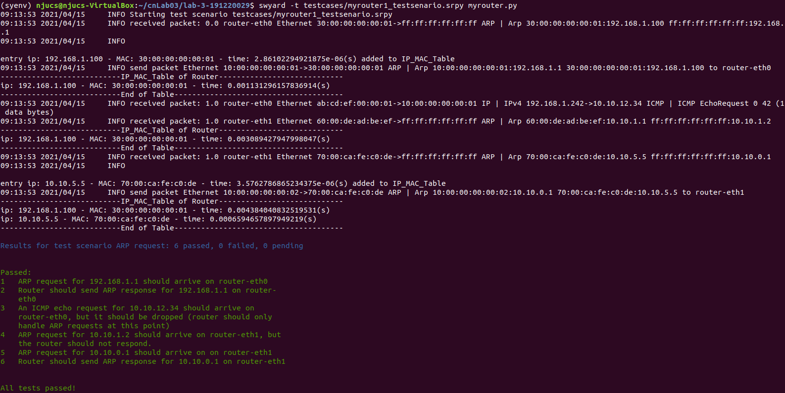

# <center>南京大学本科生实验报告</center>

课程名称： **计算机网络**						任课教师：李文中				助教：

|   学院    | 计算机科学与技术  |   专业（方向）    |   计算机科学与技术   |
| :-------: | :---------------: | :---------------: | :------------------: |
| **学号**  |     191220029     |     **姓名**      |        傅小龙        |
| **Email** | 1830970417@qq.com | **开始/完成日期** | 2021/4/9 - 2021/4/11 |

## 1.实验名称

Lab3: Respond to ARP

## 2.实验目的

学习并实现IPV4路由器对以太网中ARP包的响应和ARP表的维护

## 3. 实验内容

### 3.1 Handle ARP Request

#### 3.1.1 Coding

在`Router`对象收到包后，将通过`handle_packet(recv)`进行相关处理。

本次实验仅要求路由对发给自己的ARP请求包做出回复。其逻辑如下图所示：

```
      receive one packet
            ↓                            no
①     Is this packet  an ARP packet ?   ---->  do nothing
            ↓yes                           no
②     Is this ARP packet targeting at me? ----> do nothing
            ↓yes
③     make an ARP respond packet with my MAC and send it back
```

①`Is this packet  an ARP packet ?`

调用数据包的`get_header(Arp)`方法，获取收到的包的包头信息。如果收到的包非ARP包，那么将得到空信息，不做任何处理。

②`Is this ARP packet is requesting my MAC?`

遍历本路由的所有接口(通过调用`net.interfaces()`获取本路由的接口列表)，判断收到的ARP包的目标ip是否和本路由的ip相同。

③ `make an ARP respond packet with my MAC and send it back`

调用方法`create_ip_arp_reply(...)`生成ARP回复包，参数为被请求方的MAC，请求方的MAC，被请求方的ip，请求方的ip，然后调用方法`net.send_packet(...)`将该回复包发回给请求者。

具体的代码实现如下所示：

```python
def handle_packet(self, recv: switchyard.llnetbase.ReceivedPacket):
        timestamp, ifaceName, packet = recv
        # TODO: your logic here
        interfaces = self.net.interfaces() #get my interfaces
        log_info(f"received packet: {timestamp} {ifaceName} {packet}")
        arp = packet.get_header(Arp) #get info of ARP pack
        if arp : #only deal with ARP pack
                for interface in interfaces:
                        if arp.targetprotoaddr == interface.ipaddr:
                                packet = create_ip_arp_reply(interface.ethaddr, arp.senderhwaddr, arp.targetprotoaddr, arp.senderprotoaddr)
                                log_info(f"send packet {packet} to {interface.name}")
                                self.net.send_packet(interface.name, packet)
                                break;
```


#### 3.1.2 Testing

运行`testcases/myrouter1_testscenario.srpy`的结果如下图所示：


#### 3.1.3 Deploying

这里从`server1`ping`router`的`192.168.100.2`端口。步骤如下：

① 在本次实验目录下启动mininet

```
$ sudo python start_mininet.py
```

②打开router和server1的`xterm`终端

```
mininet> xterm router server1
```

③在server1的`xterm`终端打开wireshark监听

```
# wireshark -k &
```

④在router的`xterm`终端进入虚拟环境后运行`myrouter.py`

```
(syenv) #swyard myrouter.py
```

⑤在server1的`xterm`终端ping 192.168.100.2`

```
# ping -c3 192.168.100.2
```

获得的抓包结果如下：


在执行ping指令后，server1先向router发送ARP请求包。在上图中可以看到请求包内的目标MAC地址全0。在server1收到router发回的ARP回复包后，可以在下图看到回复包内router的MAC地址(`40:00:00:00:00:01`)被填上了。

之后server1发送ping包，由于router的逻辑暂不处理其它包，故server1并没有收到回复(可以看到图中ping包的Info项内有`no response fond`的信息)。


### 3.2 Cached ARP Table

#### 3.2.1 Coding

`ARP Table`采用list(列表)的数据结构实现。其中每个表项`(class) Tentry`的数据结构如下：

```python
class Tentry(object):
    def __init__(self, ip, mac):
        self.ip = ip
        self.mac = mac
        self.intime = time.time()
    def IP(self): #get self.ip
        return self.ip
    def TIME(self): #get self.intime
        return self.intime
    def refresh(self, mac): #reset self's mac and intime, but ip unchanged
        self.mac = mac
        self.intime = time.time()
    def to_string(self):
        return ('ip: %s - MAC: %s - time: %s(s)' % (self.ip, self.mac, time.time() - self.intime))
    
IP_MAC_Table = []; #List of Tentries
```

每个表项包含IP和MAC地址的对应关系，以及该表项被记录到ARP表的系统时间。

以本报告3.1.1节的逻辑示意图为基础，ARP表维护的逻辑如下：

```
      receive one packet
            ↓                            no
      Is this packet  an ARP packet ?   ---->  do nothing
            ↓yes                           no
      Is this ARP packet targeting at me? ----> do nothing
            ↓yes
①     Is sender's ARP Info already in ARP Table?
            ↓yes                       ↓no
①        update it                 add it to ARP Table
            |                          |
            +--------------------------+
            ↓
      make an ARP respond packet with my MAC and send it back
            ↓
②        check all entries in table, if timeout, delete it
            ↓
③        print ARP Table
```

①`Is sender's ARP Info already in ARP Table?` & `update it` & `add it to ARP Table`

​	首先遍历ARP表，如果表内有和发送方相同的ip的表项，则更新该表项的MAC和时间信息。若没有，则将发送方的ip-MAC信息添加到ARP表中。

​	相关代码实现如下：

```python
def add_entry2table(ne):
    changed_flag = 0;
    for ele in IP_MAC_Table:
        if ele.IP() == ne.IP(): #if table has entry with same ip, update it
            ele.refresh(ele, ne.mac)
            log_info(f"\n\nentry {ele.to_string()} refreshed")
            changed_flag = 1
    if ~changed_flag: #else add new entry to table
        IP_MAC_Table.append(ne)
        log_info(f"\n\nentry {ne.to_string()} added to IP_MAC_Table")
```

②`check all entries in table, if timeout, delete it`

​	遍历所有表项，用当前系统时间减去表项的时间信息，得到表项在ARP表内存在的时间。若该时间超过设定值，将之记录在一列表中，最后遍历该列表，删去之。

​	相关代码实现如下：

```python
timeout = 10
def to_check():
    curtime = time.time()
    ele = []
    for e in IP_MAC_Table:
        if curtime - e.TIME() > timeout:
            ele.append(e)
    for e in ele:
        IP_MAC_Table.remove(e)
        log_info(f"\n\nentry {e.to_string()} removed from table")
```

③`print ARP Table`

​		遍历所有表项，利用表项`Tentry`类中实现的`to_string(self)`方法打印信息。相关代码比较简单，这里不再详细展示。

#### 3.2.2 Testing

​	加入ARP表后运行`testcases/myrouter1_testscenario.srpy`的结果如下图所示：



测试样例1, 2：ip为`192.168.1.100`的节点发送ARP请求包至`router-eth0`端口，`router`此时将该节点的ARP信息添加到ARP表中，并发送ARP回复。

测试样例3：`router`收到ICMP echo请求包，不做任何响应。

测试样例4：`router`收到目标非自己的ARP请求包，应当不做响应，可以看到图中对应的ARP表没有变化。

测试样例5, 6：`router`从`router-eth1`端口收到给自己的ARP请求包，故应将发送方的信息添加到ARP表中并发送ARP回复。此时可以看到图中的ARP表中有两个表项。

以上测试并没有测试到ARP表的Timeout逻辑，故用下面的Deploying环节测试Timeout：

#### 3.2.3 Deploying

在Mininet中测试ARP表的维护，步骤如下：

① 在本次实验目录下启动mininet

```
$ sudo python start_mininet.py
```

②打开router, server1, server2, client的`xterm`终端

```
mininet> xterm router server1 server2 client
```

③在router的`xterm`终端进入虚拟环境后运行`myrouter.py`

```
(syenv) #swyard myrouter.py
```

④在server1的`xterm`终端`ping 192.168.100.2`

```
# ping -c1 192.168.100.2
```


在`router`的`xterm`终端可以看到，`router`先收到了一个来自`server1`的ARP包，`server1`的IP-MAC信息被添加至ARP表中。然后`router`发送ARP回复包给`server1`，最后`router`又收到了`server1`的ping请求包。

⑤在server2的`xterm`终端`ping 192.168.100.2`


和④中分析类似，这里不再赘述。

可以看到ARP表中已经有了`server1`和`server2`的信息。

⑥大约10s后在client的`xterm`终端`ping 10.1.1.2`


这时ARP表中`server1`和`server2`的信息都已经超时。可以在上图中看到，在向ARP表中加入`client`的信息后，删去了`server1`和`server2`的信息。最后打印出来的ARP表中只有`client`的信息。

由于`router`只回复发给自己的ARP请求包，故这里所有的ping包都100%loss.


## 4.实验总结与感想

​	本次实验实现了路由对发送给自己的ARP请求的回复，并模拟了ARP Cache表的维护。在ARP表的实现上，采用了面向对象的编程方法，将表项的数据结构加以封装，比单纯的使用字典感觉简化了许多代码编写上的麻烦。