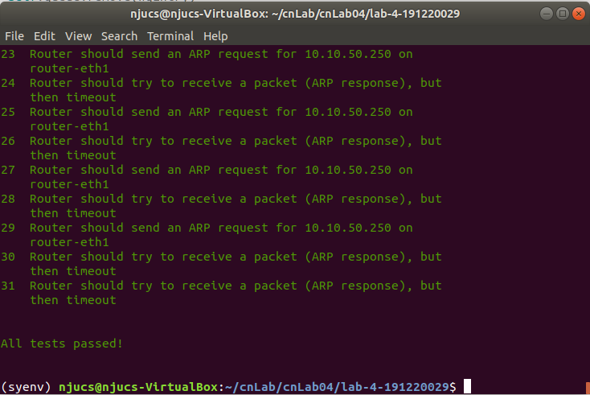
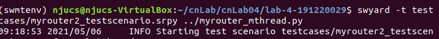
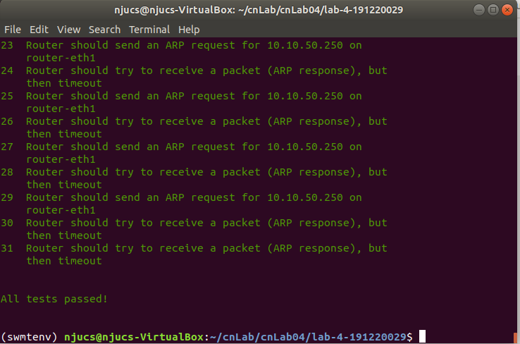

# <center>南京大学本科生实验报告</center>

课程名称： **计算机网络**						任课教师：李文中				助教：

|   学院    | 计算机科学与技术  |   专业（方向）    |  计算机科学与技术   |
| :-------: | :---------------: | :---------------: | :-----------------: |
| **学号**  |     191220029     |     **姓名**      |       傅小龙        |
| **Email** | 1830970417@qq.com | **开始/完成日期** | 2021/4/24- 2021/5/5 |

## 1.实验名称

Lab4: Forwarding Packets

## 2.实验目的

1）实现路由转发表的静态配置及最长匹配算法； 2）实现对转发所需要的目标结点的MAC地址发送ARP请求包，以转发路由收到的包。

## 3. 实验内容

### 3.1 IP Forwarding Table Lookup 

#### 3.1.1 Coding

##### A. Build Forwarding Table

转发表作为对象`class Router`的成员之一，采用列表实现。

在`class Router`的初始化函数中对转发表初始化：

```python
self.forwarding_table = []  # 'subnetIp/mask' - [next hop ip, interface name]
```

每个表项的结构为`[子网ip/子网掩码', 下一跳ip, 转发端口名]`。

转发表初始化封装为`class Router`的成员函数`init_forwarding_table()`.

路由器的每个端口都有一个与之对应的表项，从`forwarding_table.txt`文件中获取转发表表项的信息。参照实验手册中`Task2-Build Forwarding Table`环节的指导，初始化转发表的步骤如下：

```
① create entries for each interface with empty next hop
② create entries with info from "forwarding_table.txt"  
```

①：`create entries for each interface with empty next hop`

遍历路由接口，计算每个端口对应的子网ip并生成表项。由于发送给路由器自己的包不需要再次转发，故下一跳的ip为空。代码实现如下：

```python
interfaces = self.net.interfaces() #get router's interfaces
        for interface in interfaces:
            ipaddr = IPv4Address(int(interface.ipaddr) & int(interface.netmask)) # ip & mask -> subnet's ip
            subnet = IPv4Network(str(ipaddr) + '/' + str(interface.netmask))
            #next hop is empty if target is in next hop's subnet
            self.forwarding_table.append([subnet,  '',  interface.name])
```

②：`create entries with info from "forwarding_table.txt"  `

只读方式打开`forwarding_table.txt`文件， 采用迭代器遍历文件的每一行，将非空行的信息添加到转发表中。代码实现如下：

```python
with open("forwarding_table.txt", "r") as ft_file: # read only if no other parameter, too
            for row in ft_file:
                info = row.rsplit() #remove empty char at the end of row
                if info: #info is not empty row
                    subnet = IPv4Network(info[0] + '/' + info[1])
                    self.forwarding_table.append([subnet, info[2], info[3]])
        # ft_file.close() # no need to close because 'with' clause has helped us to do it
```

转发表的初始化这一步骤应在路由器开始收发包之前完成。故在`class Router`的`start()`函数的开始处调用：

```python
 def start(self):
        self.init_forwarding_table()
        ...
```

##### B. Match Destination IP Addresses against Forwarding Table

路由器在收到`ipv4`包后，需要对该包的目标地址进行解析，通过最长前缀匹配在转发表中找到该包的下一跳，修改该包的相关信息并将之转发。到转发之前的执行逻辑如下所示：

```
received one packet
       ↓                 yes
Is this one arp packet?  -->    ...(this part has been implemented in lab3) 
       ↓no                no
①Is this one ipv4 packet? -->    do nothing
       ↓yes   no
①   ttl > 0?  --> do nothing
       ↓yes(ttl--)      yes
②Is this packet for me? --> drop it
       ↓no                                 match failed
③find one longest match in forwarding_table -------------> drop it
       ↓ match exist
④modify packet's info and add it to the waiting queue
```

①`Is this one ipv4 packet?` & `ttl > 0?`

用`if`语句实现即可：

```python
 elif ipv4 and ipv4.ttl > 0:
        packet[1].ttl -= 1
```

②`Is this packet for me?`

遍历路由器所有的接口，如果该包的目的ip地址为本路由器的某一接口地址，那么暂不处理该包。用变量`forward_flag`记录这一状态。

```python
forward_flag = True
for interface in interfaces:
	if ipv4.dst == interface.ipaddr: # if pkt destinated to router, drop it
		forward_flag = False
		log_info(f"packet sent to my intf and dropped: {packet} ")
		break
```

③`find one longest match in forwarding_table`

​	遍历转发表的所有表项，计算包的目的ip地址与每个前缀的最大匹配长度，并记录最长匹配长度`cur_prefixlen`及前缀对应的子网`subnet`及表项`forward_entry`。

```python
 if forward_flag:
	for ele in self.forwarding_table:
        prefixnet = ele[0]
	# find one longest macth
	    if ipv4.dst in prefixnet:  
		    if prefixnet.prefixlen > cur_prefixlen:
		    	subnet = prefixnet
		    	cur_prefixlen = prefixnet.prefixlen
                forward_entry = ele
```

​	如果匹配失败，那么有`cur_prefixlen == 0`， 对匹配失败的数据包暂不处理。

```python
if cur_prefixlen != 0:
	#...(④modify packet's info and add it to the waiting queue)...
else :
	print("!!prefix macth failed!!")
```


④`modify packet's info and add it to the waiting queue`

​	根据③中的匹配结果，查找转发表中对应的下一跳ip地址。需要注意的是如果该包的目的ip是直接本路由相连的下一层设备，那么转发表中对应的下一跳ip为空，此时下一跳ip地址即为数据包的目的ip地址。

​	在获取下一跳ip后，修改当前包的源mac地址为匹配接口的mac，然后将之加入转发的等待队列。

```python
if forward_entry[1]: # get next hop ip
	nhopip = IPv4Address(forward_entry[1])
else : # target is directly connected with the router whose next hop is empty
	nhopip = ipv4.dst
	intf = forward_entry[2]
	for interface in interfaces: # get next interface
		if interface.name == intf:
			packet[0].src = interface.ethaddr
			print(f"packet from {interface.name} with nexthopip {nhopip} waiting to forward")
			self.queue.append(WQentry(packet, interface, nhopip))
				break
```

等待队列`queue[]`的表项`class WQentry`在3.2.1节再做详细介绍。

### 3.2 Forwarding the Packet and ARP

#### 3.2.1 Coding

​	调度等待队列中的数据包进行转发的功能由`class Router`的成员函数`forward()`完成。`forward`函数会尝试转发等待队列`queue[]`中所有的包，并将完成转发流程（转发成功或失败）的包从等待队列中删除。为此，用`finish[]`记录完成转发流程的包. `arp_sent[]`用于记录当前调度已经发出的arp请求包的目的ip，以保证1s内只对同一ip问询一次mac地址。

​	`forward()`函数实现逻辑如下：（由于该函数实现较简单，报告中不再给出详细代码）

```
>iterate all pkts in waiting queue, try to forward it
|   |                     |                   |
|	|forward successfully |fail to forward    |waiting arp reply
|   +----------+----------+                   ↓
|              ↓                          do nothing   
|      add it to finish[] list
>iterate all items in finish[] list, del pkts in waiting queue accordingly
```

​	对等待队列中的数据包进行转发尝试的时机应该是路由器不在处理收到包的空闲时间。故在路由器`class Router`的成员函数`start()`的执行逻辑中的try语句块前添加`forward()`函数的调用.

```python
 while True:
 	self.forward()
 	try:
        #...
```

```python
if(recv_flag):
 	self.handle_packet(recv)
self.forward()
```

​	转发数据包和发送ARP请求包的具体操作由`class WQentry`的成员函数`pkt_forwarding()`实现，其返回值根据上面`forward()`的逻辑，设计了三种状态：`1-转发成功`, `0-等待下一跳回复arp`，`-1-转发失败`.

​	等待队列中的表项`class WQentry`包含了包的数据、转发接口、下一跳ip、上一次arp请求的时间以及转发该包总共进行的arp问询次数。

```python
def __init__(self, _packet, _interface, _nhopip):
    self.packet = _packet
    self.interface = _interface
    self.nhopip = _nhopip
    self.last_request_time = 0   # last time sending arp request
    self.count = 0               # total count of sending arp request
```

​	`pkt_forwarding()`的实现逻辑如下：

```
① arp cache table already has next hop's mac-ip info?
   |                                    ↓yes                  
   |                        ② send the packet out according to the info
   ↓ no                       and return "success" status(1)
③ check if arp request can send out now:
  no arp reply received for more than 1s and no other pkts to the same next hop also waiting
  |                                              |
  ↓ yes                                          | no
④ sending no more than 5 requests                | (wait next process)
  |        ↓ no                                  |
  ↓ yes  return "failed" status(-1)              |
④ make an arp requst and refresh relative data   |
  |                                              |
  +----------------------------------------------+
  ↓
③ return "waiting" status(0)
```

① `arp cache table already has next hop's mac-ip info?`

通过arp缓存表提供的查找ip-mac对应关系的函数`ip2mac(ip)`判断缓存表中是否已经有下一跳的mac地址：

```python
def ip2mac(ip):
    for e in IP_MAC_Table:
        if e.IP() == ip:
            return e.mac
    return
```

如果返回值为空，那么说明缓存表中没有下一跳的mac.

```python
if ip2mac(self.nhopip): 
    # ②...
elif #③...
```

②`send the packet out according to the info and return "success" status(1) `

将转发包的目的mac地址替换为下一跳的mac后转发即可.

```python
self.packet[0].dst = ip2mac(self.nhopip) #replace packet's dstMac
net.send_packet(self.interface.name, self.packet)
print(f"forwarding packet {self.packet} to {self.interface.name}\n")
return 1                                # packet forwarded successfully
```

③`check if arp request can send out now`

根据逻辑示意图中的描述:

```python
elif time.time() - self.last_request_time >= 1 and self.nhopip not in arp_sent:
    # if dst hasn't replied my arp request for 1s or nhopip hasn't been requested for arp yet, send one arp request
    # ④...
else:
    return 0 # waiting arp reply
```

④ `sending no more than 5 requests` & `make an arp requst and refresh relative data`

满足发送arp请求的条件时，创建`Ethernet`和`Arp`对象，填入对应信息后组合成一个arp请求包，向下一跳接口广播，更新当前包的arp请求时间和请求次数。

```python
if self.count < 5:                  # send arp request less than 5 times
 	print(f"No.{self.count} questioning target ARP...")
 	arp_sent.append(self.nhopip)
 	#packet = create_ip_arp_request(self.interface.ethaddr, self.interface.ipaddr, self.nhopip)
 	ether_header = Ethernet(src = self.interface.ethaddr,
 						    dst = "ff:ff:ff:ff:ff:ff",
 						    ethertype = EtherType.ARP)
 	arp_header = Arp(operation = ArpOperation.Request,
					 senderhwaddr = self.interface.ethaddr,
					 senderprotoaddr = self.interface.ipaddr,
					 targethwaddr = "ff:ff:ff:ff:ff:ff",
					 targetprotoaddr = self.nhopip)
 	packet = ether_header + arp_header
 	self.last_request_time = time.time()
 	net.send_packet(self.interface.name, packet)
 	log_info(f"send arp request {packet} via {self.interface.name}")
 	self.count += 1
 	return 0 # waiting arp reply
else:
 	return -1 # timeout and drop this packet
```

#### 3.2.2 Testing



#### 3.2.3 Deploying

启动mininet后，在server1的xterm终端ping server2.

```
server1 # ping -c2 192.168.200.1
```

使用wireshark在`router-eth0`, `router-eth1`, `router-eth2`接口抓包，抓包结果如下：

`router-eth0`


`router-eth1`


`router-eth2`没有抓到包（符合预期）.

​	在server1发出ping请求前，server1尚不知道下一跳router(`192.168.100.2`)的mac, 故发送arp请求， 对应`router-eth0`接口抓到的第1个包。`router`在收到该包后学习到了`server1`的mac地址，然后发送arp回复，对应`router-eth0`接口抓到的第2个包。

​	server1收到arp回复后，发送ping请求，对应`router-eth0`抓到的第3个包. router在收到server1的ping请求后，查询转发表得到下一跳ip为192.168.200.1, 但是router的arp cache中并没有该地址的mac, 故需要向该地址发送arp请求，然后server2发送arp回复，router将学习到的mac添加到缓存表中，对应`router-eth1`抓到的第1-2个包.

​	之后router将等待队列中的ping请求包发送给server2，server2发回ping请求，对应`router-eth1`抓到的第3-4个包. 然后router将收到的ping回复发送给server1，对应`router-eth0`抓到的第4个包。

​	`router-eth0`中抓到的第5-6个包和`router-eth1`中抓到的第5-6个包是第二轮ping操作.

​	`router-eth1`中抓到的第7-8个包是server2的接口向router的`router-eth1`接口发出的arp请求及router作出的回复，不是本次ping操作直接产生的数据。

### 3.3 Multi-thread design

​	考虑到路由器的功能特性，给路由器的收包和发包分别设计了两个线程`(class)rcvThread`,`(class)fwdThread`，基于`threading`库将这两个线程封装为`(class)Thread`的子类.

​	`rcvThread`线程的执行逻辑仅包括收包的部分，即原来`Router`的`start()`函数中的try语句块.

```python
class rcvThread(threading.Thread):
    def __init__(self, threadID, name, router):
        threading.Thread.__init__(self)
        self.threadID = threadID
        self.name = name
        self.router = router
    def run(self):
        print (f"thread {self.name} staring")
        while(True) :
            try:
                recv = self.router.net.recv_packet(timeout=1.0)
            except NoPackets:
                continue
            except Shutdown:
                break
            self.router.handle_packet(recv)
        print (f"thread {self.name} exited")  
```

​	`fwdThread`线程的执行逻辑为：当`Router`的等待队列`queue`非空时尝试转发队列中的包。若收包线程`rcvThread`已经结束，那么在清空等待队列后退出.

```python
class fwdThread(threading.Thread):
    def __init__(self, threadID, name, router, rcvtrd):
        threading.Thread.__init__(self)
        self.threadID = threadID
        self.name = name
        self.router = router
        self.rcvtrd = rcvtrd
    def run(self):
        print (f"thread {self.name} staring")
        while(True) :
            if self.router.queue :
                self.router.forward()
            if not self.rcvtrd.isAlive() and not self.router.queue :
                self.join()
        print (f"thread {self.name} exited")
```

这样，`Router`的`start()`函数内的循环语句只需要改为实例化一个收包和发包的线程并启动它们，在执行结束后杀死这两个线程即可。

```python
rcvTrd = rcvThread(2, "Recieve1", self)
print("Recieve1 thread created!")
fwdTrd = fwdThread(1, "Forward1", self, rcvTrd)
print("Forward1 thread created!")
rcvTrd.start()
fwdTrd.start()
rcvTrd.join()
fwdTrd.join()
```

​	临界区管理：router的等待队列、arp缓存表为临界区，需要使用进程锁：

```python
threadLock = threading.Lock() 
```

在涉及对临界区操作的位置添加`threadLock.acquire()`和`threadLock.release()`即可.

测试结果如下：





由于并没有找到实验手册上关于多线程实现提交的说明，将相关代码置于`./report/myrouter_multithread.py`中以备查验。

## 4.实验总结与感想

​	本次实验主要模拟实现了网络层中路由器静态设置的IP转发表。尽管实验难度较之前有所提升，但通过这次实验，更加深入了解了网络中路由器的执行逻辑。

