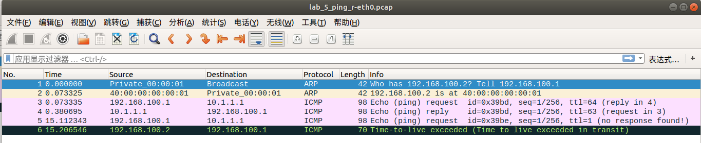

# <center>南京大学本科生实验报告</center>

课程名称： **计算机网络**						任课教师：李文中				助教：

|   学院    | 计算机科学与技术  |   专业（方向）    |   计算机科学与技术    |
| :-------: | :---------------: | :---------------: | :-------------------: |
| **学号**  |     191220029     |     **姓名**      |        傅小龙         |
| **Email** | 1830970417@qq.com | **开始/完成日期** | 2021/5/14 - 2021/5/16 |

## 1.实验名称

Lab5：Respond to ICMP

## 2.实验目的

设计并实现路由器对ICMP包的回复，并在必要的时候生成ICMP错误信息的相关逻辑.

## 3. 实验内容

### 3.1 Responding to ICMP echo requests

#### 3.1.1 Coding

​	这里要求实现路由器对收到的`ICMP echo request`作出回复。当然，对于不是发给自己的请求则转发之，对于收到的非ICMP请求则发出`ICMP error`信息.

​	执行逻辑如下：

```
Is this packet for me? ------------------------------+
	|yes						no  			     |
	↓												 |
Does this packet have ICMP header? ------------------+
	|yes						  		no			 |
	↓												 |
Is this packet ICMP echo request?                    |
	|yes			↓no                              |
	↓		create a ICMP error message--------------+
create a ICMP reply packet                           |
	|												 |
	+------------------------------------------------+
	↓
......

```

​	回复包的ICMP包头需要重新生成：序列号和请求包的相同，标识符和请求包的相同，数据和请求包的相同。回复包的IP包头中的目的ip为原来请求包IP包头的源ip,源ip为路由接口的ip.

​	代码实现如下：

```python
for interface in interfaces:
	if ipv4.dst == interface.ipaddr :
		if icmp and icmp.icmptype == ICMPType.EchoRequest: # echo request
			print("This pkt makes an echoRequest for me.")
			echo_reply = ICMP()
			echo_reply.icmptype = ICMPType.EchoReply
			echo_reply.icmpdata.sequence = icmp.icmpdata.sequence
			echo_reply.icmpdata.identifier = icmp.icmpdata.identifier
			echo_reply.icmpdata.data = icmp.icmpdata.data
			packet[icmp_index] = echo_reply
			packet[ipv4_index].dst = packet[ipv4_index].src
			packet[ipv4_index].src = interface.ipaddr
			ether, ipv4, icmp = self.headers(packet)
            break
		else: # not echo request, send ICMP destination port unreachable error pkt
 			print("oh! this pkt is for me but not ICMP")
 			'''Implemented in 3.2.1 Coding part'''
......
```

### 3.2 Generating ICMP error messages

#### 3.2.1 Coding

​	ICMP错误信息包括原数据包ICMP包头的28字节，错误类型和错误码. ICMP错误信息的生成封装于`ctreate_icmp_err(self, packet, interface, err_type, err_code)`函数中，参考实验手册Task3 Coding环节，其实现如下：

```python
def ctreate_icmp_err(self, packet, interface, err_type, err_code):
        i = packet.get_header_index(Ethernet)
        ether = packet[i]
        # remove Ethernet header --- the errored packet contents sent with the ICMP error message should not have an Ethernet header
        del packet[i]
        ipv4_index = packet.get_header_index(IPv4)
        #icmp_index = packet.get_header_index(ICMP)

        icmp = ICMP()
        ip = IPv4()
        # protocol defaults to ICMP
        ip.protocol = IPProtocol.ICMP
        ip.ttl = default_ttl
        ip.dst = packet[ipv4_index].src
        ip.src = interface.ipaddr
        icmp.icmptype = err_type
        icmp.icmpcode = err_code
        icmp.icmpdata.data = packet.to_bytes()[:28]
        print(f"icmp_error pkt created:{ether + ip + icmp}")
        return ether + ip + icmp
```

本次实验需要路由器能够生成的ICMP错误信息的情况有以下四种：

##### ①	*ICMP destination network unreachable*

​	在转发包时，若最长匹配失败，那么需要向发送方发送这一错误信息. 相关逻辑如下：

```
if longest prefix match failed
|____then create ICMP error message packet accordingly
|____make a longest prefix match for error message packet
add packet to waiting queue
```

代码实现如下：

```python
...(longest prefix match)...
if cur_prefixlen == 0:
 	print("oh! prefix macth failed!!")
 	for interface in interfaces:
        if interface.name == ifaceName:
            packet = self.ctreate_icmp_err(packet, interface, ICMPType.DestinationUnreachable, 0)
            ether, ipv4, icmp = self.headers(packet)
            break
    cur_prefixlen, packet, nhopip, interface = self.longest_prefix_match(packet)
 	print(f"packet from {interface.name} with nexthopip {nhopip} waiting to forward")
 	self.queue.append(WQentry(packet, interface, nhopip))
...(ttl check)...
```

##### ②	*ICMP time exceeded*

在IPv4包头的TTL项减为0时，路由器将抛弃该包，并向发送方发送这一错误信息. 对TTL项的检查应在最长匹配之前.

代码实现如下：

```python
if packet[ipv4_index].ttl <= 0:
    print("oh! this packet has expired!(ttl <= 0)")
    for interface in interfaces:
        if interface.name == ifaceName:
            packet = self.ctreate_icmp_err(packet, interface, ICMPType.TimeExceeded,     ICMPCodeTimeExceeded.TTLExpired)
            ether, ipv4, icmp = self.headers(packet)
            break
	cur_prefixlen, packet, nhopip, interface = self.longest_prefix_match(packet)
...(add packet to waiting queue)...
```

##### ③	*ICMP destination host unreachable*

​	在路由器转发包时，若无法获取下一跳的mac信息，那么取消所有相同下一跳的包的转发操作，并向这些包的不同的发送方发送这一错误信息。

​	在具体实现中，在发现有包转发失败后，遍历队列中所有等待转发的包，若和转发失败的包由相同的下一跳ip，那么将该项添加到完成队列`(List) finish`等待删除，并采用`(List) source`来记录该包的发送方ip，若该ip是新加入的一项，那么向该ip发送对应的ICMP错误信息。

​	代码实现如下：

```python
'''wqEntry failed to forward:'''
source = [] # senders who send pkts to same next hop
for tmp_entry in self.queue:
    if tmp_entry.nhopip == wqEntry.nhopip:
        finish.append(tmp_entry)
        ipv4_index = tmp_entry.packet.get_header_index(IPv4)
        if tmp_entry.packet[ipv4_index].src not in source:
            source.append(tmp_entry.packet[ipv4_index].src)
            packet = self.ctreate_icmp_err(wqEntry.packet, wqEntry.interface, ICMPType.DestinationUnreachable, 1)
            interfaces = self.net.interfaces
            prefixlen, packet, nhopip, interface = self.longest_prefix_match(packet)
            packet[packet.get_header_index(IPv4)].src = interface.ipaddr
            self.queue.append(WQentry(packet, interface, nhopip))
```


##### ④	*ICMP destination port unreachable*

​	当路由器收到发送给自己的包后，若不是`ICMP echo request`，那么需要向发送方发送这一错误信息。这一部分的具体位置在`3.1.1 Coding`环节的代码空缺部分.

​	代码实现如下：

```python
for interface in interfaces:
    if interface.name == ifaceName:
        packet = self.ctreate_icmp_err(packet, interface, ICMPType.DestinationUnreachable,  3)
        ether, ipv4, icmp = self.headers(packet)
        break
```

注：每个类型错误信息的错误码在API Reference上可查阅到：

```python
>>> list(ICMPTypeCodeMap[ICMPType.DestinationUnreachable])
[ <DestinationUnreachable.HostUnreachable: 1>,
  <DestinationUnreachable.NetworkUnreachable: 0>,
  <DestinationUnreachable.PortUnreachable: 3>
  ...
]
>>> i = ICMP()
>>> i.icmpcode
<ICMPCodeTimeExceeded.TTLExpired: 0>
```

#### 3.2.2 Testing

测试结果如下：


#### 3.2.3 Deploying

##### A. ICMP Echo Request

​	在`server1`端向`client`发送一个ICMP Echo Request:

```
(server1)# ping -c 1 10.1.1.1
```

预期能够正确收到`client`发来的ICMP Echo Reply

​	然后再发送一个ttl为1的ICMP Echo Request:

```
(server1)# ping -c 1 -t 1 10.1.1.1
```

预期将收到`Router`发来的ICMP错误信息:TTL = 0

监听`router-eth0`接口，得到以下结果：



可以发现，第一次的ping操作收到了回复（对应第4个包），而第二次ping操作由于包的ttl减为0，router产生了`ttl exceeded`的ICMP错误信息。

​	修改`start_mininet.py`，添加一条路由`set_route(net, 'server1', '177.1.0.0/16', '192.168.100.2')`, 然后启动mininet, 在在`server1`端向`177.1.0.0`发送一个ICMP Echo Request:

```
(server1)# ping -c 1 -t 1 177.1.0.0
```

预期将受到`Router`发送的ICMP错误信息：Destination Port Unreachable.

在`router-eth0`抓包结果如下：


##### B. Traceroute

在`server1`端以`client`为目标执行traceroute指令：

```
(server1)# traceroute 10.1.1.1
```

监听`server1-eth0`端口，得到以下结果：


​	`server1`在通过ARP知道下一跳(router-eth0)的mac后，连续发送了19UDP包，这些UDP包的TTL从1开始，每3个递增1直到7，直到收到`client`发来的包才停止. `client`最后发送了6个ICMP error(Port unreachable)，中间的3个(No.19, 21, 23)ICMP error包为router发送的，错误码为ttl exceeded.

traceroute结果如下：


## 4.实验总结与感想

​	本次实验完成了IPv4路由的最后一部分：响应ICMP。 通过本次实验进一步认识到了网络层路由的逻辑以及ICMP协议相关的数据结构及原理.


## 5.遇到的问题和思考

​	在对发送给路由器自己的非ICMP包作出ICMP error message响应时(对应3.2.1 ④ICMP destination port unreachable)，不能直接将该包的目的ip作为ICMP错误信息的源ip，否则将导致错误。

​	这是由于在判断包是否是发送给路由器的时候，条件是目的ip是否是路由器所有接口中的一个，这个接口可能并不是路由器收到包的那一个接口。ICMP error message包的转发接口应当是路由器收到包的接口才对。