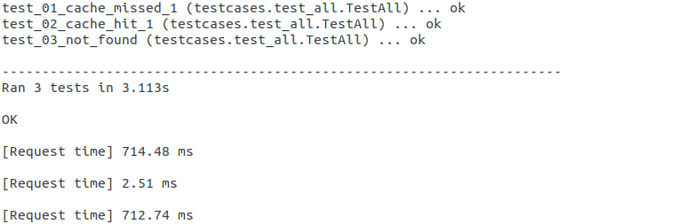
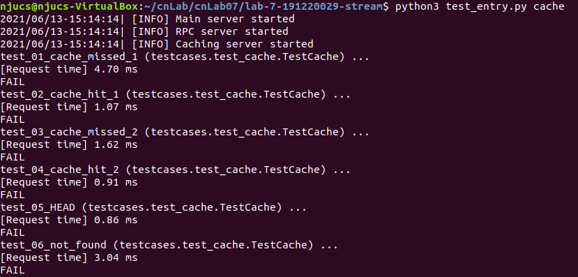

# <center>南京大学本科生实验报告</center>

课程名称： **计算机网络**						任课教师：李文中				助教：

|   学院    | 计算机科学与技术  |   专业（方向）    |  计算机科学与技术   |
| :-------: | :---------------: | :---------------: | :-----------------: |
| **学号**  |     191220029     |     **姓名**      |       傅小龙        |
| **Email** | 1830970417@qq.com | **开始/完成日期** | 2021/6/4 - 2021/6/5 |

## 1.实验名称

Lab7: Content Delivery Network

## 2.实验目的

​	构建一个简单的CDN模型，模拟网络中DNS服务器和CDN节点给给用户提供的数据传输服务。

## 3. 实验内容

### 3.1 DNS server

#### 3.1.1 Coding

##### Step1: Load DNS Records Table

​	考虑到DNS记录有：域名、类型、记录值这三个元素，将每条记录抽象为一个类`class DNS_INFO`, 其成员变量`self._domain`,`self._rType`,`self._rVal`分别对应上述的三元素。另用一成员变量`self._pattern`记录域名对应的正则表达式，在初始化时生成这一正则表达式。

​	由于域名中的特殊字符只有`*`，这里表示任意长度不含`.`的非空字串，对应正则表达式`([^\.]+)`. 

​	域名中的`.`在正则表达式中已有”任意字符“的含义，在生成正则表达式时要将之转义:`\.`.

​	`class DNS_INFO`的相关成员函数如下所示：

```python
class DNS_INFO():
    def __init__(self, domain, rType, rVal):
        self._domain = domain
        self._rType = rType
        self._rVal = rVal
        self._pattern = ""
        for i in domain:
            if i == '.' :
                self._pattern = self._pattern + "\\."
            elif i == '*':
                self._pattern = self._pattern + "([^\\.]+)"
            else :
                self._pattern = self._pattern + i

    def domain(self):
        return self._domain
    def pattern(self):
        return self._pattern
    def info(self):
        return self._rType, self._rVal
```

##### Step2: Reply Client's DNS Request

​	将收到用户请求访问的域名和DNS记录表中的域名进行匹配。若没有匹配项，返回空结果。若有`CNAME`类匹配项，返回该项的信息；若有`A`类匹配项，返回距离用户更近的服务器。

​	匹配方式采用python提供的re模块中的`match`方法进行正则表达式匹配。DNS记录的域名对应的正则表达式的生成方法在`Step1`中已给出。

```python
def get_response(self, request_domain_name):
	response_type, response_val = (None, None)
    client_ip, _ = self.client_address
    # match domain_name in table
    domain_valid = False
    i = None
    for i in self.table:
        #print(f"{i.pattern()} {request_domain_name}")
        res = re.match(i.pattern(), request_domain_name)
        if  res is not None:
            domain_valid = True
            break
    if domain_valid:
        response_type, response_val = i.info()
        #print(f"{response_type} {response_val}")
        if response_type == 'A' and len(response_val) > 1:
            # then need to find one IP with min distance
            cur_ip = response_val[0]
            cur_distance = self.calc_distance(client_ip, cur_ip)
            for j in response_val:
                d = self.calc_distance(client_ip, j)
                if cur_distance > d:
                    cur_ip = j
                    cur_distance = d
            response_val = cur_ip
        else :
             response_val = response_val[0]
    else :
        print("No valid domain name found")
        return (response_type, response_val)
```

​	用户与服务节点距离的计算封装于`self.calc_distance(...)`中. 通过调用`IP_Utils.getIpLocation(ip_str)`方法获取相应`ip`地址的经纬度。以直角坐标系两点距离公式计算距离并返回。若无法获取某一`ip`的经纬度，那么在合适的范围随机生成该`ip`的经纬度进行计算。

```python
def calc_distance(self, pointA, pointB):
    ''' TODO: calculate distance between two points '''
    a_latitude, a_longitude = IP_Utils.getIpLocation(pointA)
    if a_latitude == None or a_longitude == None:
        a_latitude =random.uniform(-90, 90)
        a_longitude = random.uniform(0, 180)
    b_latitude, b_longitude = IP_Utils.getIpLocation(pointB)
    if b_latitude == None or b_longitude == None:
        b_latitude =random.uniform(-90, 90)
        b_longitude = random.uniform(0, 180)
    return math.sqrt(math.pow((a_latitude - b_latitude), 2) + math.pow((a_longitude - b_longitude), 2))
```

#### 3.1.2 Testing dns


### 3.2 Caching server

#### 3.2.1 Coding

##### Step1: HTTPRequestHandler

**A. sendHeaders()**

​	调用`self.send_header(keyword, value)`方法将`self.headers`中的每个`HTTP header`添加到输出流缓存。完成这一步骤后，调用`self.end_headers()`方法结束输出流缓存的写入并发送缓存中的信息。

```python
def sendHeaders(self):
    ''' Send HTTP headers to client'''
    for header, value in self.headers:
        self.send_header(header, value)
    self.end_headers()
```

**B. do_GET()**

​	根据用户发送的请求路径，调用`self.server.touchItem(...)`读取`cachingServer`中的相应缓存。若缓存可用，则发送`HTTPStatus.OK`状态码，然后调用`self.sendHeaders()`和`self.sendBody(...)`方法发送数据。若缓存不可用，则发送`HTTPStatus.NOT_FOUND`错误码。

```python
def do_GET(self):
    ''' Logic when receive a HTTP GET.
    Notice that the URL is automatically parsed and the path is stored in
    self.path. 
    '''
    self.headers, body = self.server.touchItem(self.path)
    if self.headers is not None and body is not None:
        self.send_response(HTTPStatus.OK)
        self.sendHeaders()
        self.sendBody(body)
     else :
        self.send_error(HTTPStatus.NOT_FOUND, "'File not found'")
```

**C. do_HEAD()**

​	逻辑和`do_GET()`相同，只是不调用`sendBody()`发送用户请求的内容。故此处不再展示代码。

##### Step2: Caching Server

- **touchItem(path)**

​	以路径`path`为键值，在缓存表中查找对应的信息。若缓存表中没有该项的信息或对应项已超时，则向服务器重新请求相应的信息，并将之添加到缓存表中。否则直接从缓存表中获取`(headers, body)`信息。

```python
def touchItem(self, path: str):
    ''' Touch the item of path.
    This method, called by HttpHandler, serves as a bridge of server and
    handler.
    If the target doesn't exsit or expires, fetch from main server.
    Write the headers to local cache and return the body.
    '''
    body = None
    headers = None
    if path in self.cacheTable.data.keys() and not self.cacheTable.expired(path):
        headers = self.cacheTable.getHeaders(path)
        body = self.cacheTable.getBody(path)
    else :
        response = self.requestMainServer(path)
        if response is not None:
            headers = response.getheaders()
            body = response.read()
            self.cacheTable.setHeaders(path, headers)
            self.cacheTable.appendBody(path, body)
    return headers, body
```

##### Step3: Stream Forwarding

​	Caching server每从Main server收到64KB大小的body的部分数据，将之缓存并同步转发给用户端。

​	依照上述逻辑，`touchItem(...)`中在收到Main server的回复后并不马上获取body的数据，仅返回headers信息和空的body部分。在`(class)CachingServer`中添加成员变量`self.response`暂存Main server发来的回复。

```python
def touchItem(self, path: str):
    ...
    body = None
    headers = None
    ...
        response = self.requestMainServer(path)
        if response is not None:
            self.response = response
            headers = response.getheaders()
            #body = response.read()
            self.cacheTable.setHeaders(path, headers)
            #self.cacheTable.appendBody(path, body)
    return headers, body
```

​	在`(class)CachingServer`中添加成员函数`fetch_body()`来实现body数据的流式转发。用一64KB大小的`bytearray`型变量`buffer`作容器，从`self.response`中通过调用`readinto(...)`获取数据。在每次获得非空数据后，通过语句`yield buffer`来使函数返回iterable对象，这样调用者就获得了一个64KB长的body片段。之后将buffer写入缓存并重复这一过程直到读出数据的长度为0.

```python
def fetch_body(self, path: str) :
    # size of buffer is 64KB
    buffer = bytearray(64 * 1024)
    length = self.response.readinto(buffer)
    if length == 0:
        return None
    while length is not 0:
        yield buffer
        self.cacheTable.appendBody(path, buffer)
        length = self.response.readinto(buffer)
```

​	那么在`do_GET(...)`中，如果`touchItem`返回了有效的headers但是body为`None`，那么就说明缓存没有命中，需要调用上面实现的`fetch_body(...)`向Main server拉取body的数据并发送给用户端。若body有效，那么直接调用`sendbody(...)`将body发送给用户端即可。

```python
def do_GET(self):
	...
    self.headers, body = self.server.touchItem(self.path)
    if self.headers is not None:
        self.send_response(HTTPStatus.OK)
        self.sendHeaders()
        if body is not None:
            self.sendBody(body)
        else :
            for buffer in self.server.fetch_body(self.path):
                self.sendBody(buffer)
    ...
```

#### 3.2.2 Testing cache


### 3.3 Deployment

​	在`OpenNetLab`平台部署CDN模型后，得到如下结果：

**cache_log:**


**dns_log:**


**client_log:**



​	结合Cache Server, DNS server和用户端的日志文件，发现测试流程如下：

① 用户向DNS服务器发出访问`sftw.localhost.computer.`的请求，DNS服务器将缓存节点ip地址返回给用户端，用户端将请求发给缓存节点。缓存节点发现本地没有相应资源，向远端的服务器发送请求。在收到资源后将之发送给用户。这一过程用时714.51ms.

② 用户重复发送①中请求，缓存节点可直接从本地拉取资源并发送给用户。这一过程用时2.63ms.

③ 用户请求访问一个远端服务器上并不存在的资源。缓存节点在发现服务器上没有这一资源后发回404错误信息给用户。这一过程用时704.07ms.

​	可以发现，命中缓存的传输用时大大缩短，而对远端服务器的访问需要耗费大量时间。

## 4.实验总结与感想

​	本次实验模拟了网络中应用层的CDN模型。通过分布式的服务系统，网络中的缓存节点能够给附近的用户提供服务，提高了离主服务器距离较远的用户的体验，也能够缓解主服务器的压力。这一实验贴合生活实际，加深了对网络中数据传输服务的理解。

​	另外，这里提出对于手册内容的一个小意见。本次实验的Task3:Caching server - Testcases部分给出了测试Caching server实现逻辑的测试样例。手册前面的Task3:Caching server - Manually部分让同学们在终端运行Main server和Caching server手动测试实现逻辑的正确性。如果完成手动测试后没有关闭这两个服务器，那么在Testcases部分的测试因为对应端口被终端中已经打开的服务器占用而无法启动测试需要跟踪的服务器，最终导致测试样例全部FAIL的情况，如下图所示：



​	我和我的室友（们）在完成本次实验的时候都踩到了这个坑，QQ群中也有同学提出过这个问题。所以希望暖心的zjgg能够拨冗修改一下手册，在Task3:Caching server - Testcases下添加一条提示信息让同学们记得关闭终端打开的服务器再去运行测试样例。